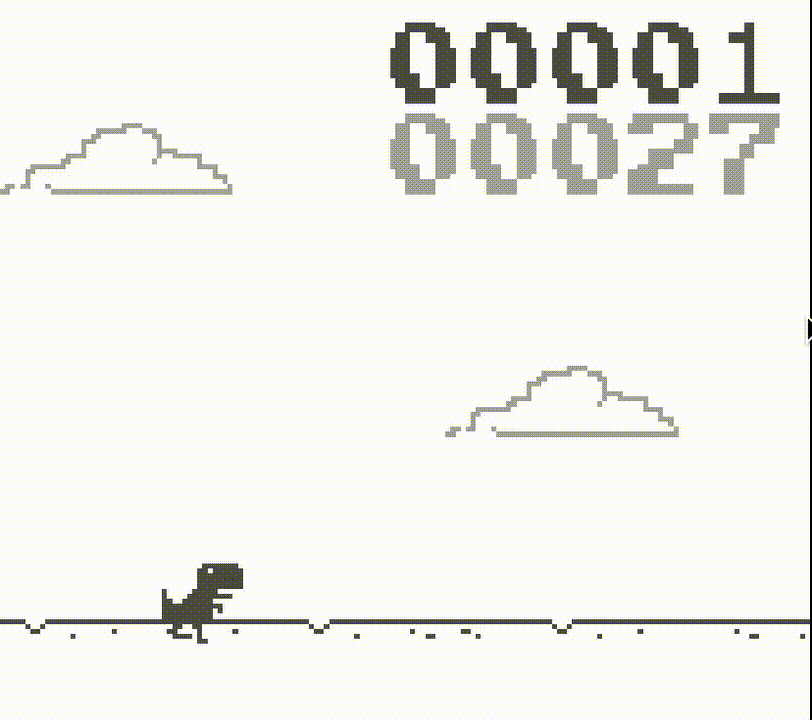

# Dino Boy

### A work-in-progress Nintendo Game Boy port of the Chromium Dino mini game

__Note: The source code for the original Chromium version is available at__: https://cs.chromium.org/chromium/src/components/neterror/resources/offline.js

If you'd like, run the following commands in `Bash` for maximum fun!

```shell
echo "alias dino="make"" >> ~/.bashrc
source ~/.bashrc
```

Now you can start the game with a `dino run` command from the repository root, which is appropriate and overall fantastic. Some assembly is required, though (and not of the LR35902 kind). Basically, make sure to modify the `Makefile` so that everything under `Directories` and `Binaries` points to where it needs to. This assumes you have a [GBDK](http://gbdk.sourceforge.net/) installation up and running.

If you'd rather just compile it manually, use the `GBDK` compiler front-end, `lcc`, as follows (from the repository root):

```shell
lcc src/main.c -o dinoboy.gb
```

Then open the resulting `dinoboy.gb` file with your favorite emulator!

<br/>
<br/>
<br/>

<center>
    
</center>